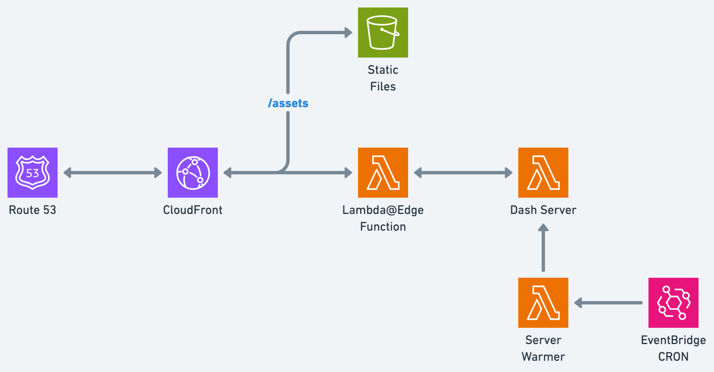

# OpenDash
OpenDash prepares a [Plotly Dash](https://github.com/plotly/dash) application into artifacts that can be deployed to AWS. A Dash application is a Flask application that uses Plotly.js and React.js to create interactive web visualizations. OpenDash's core functionality extracts static assets from Dash's internal Flask server and prepares them for deployment to S3.

## Features
OpenDash produces 3 main artifacts. The output folder structure is a mirror of OpenNext's folder structure. The main artifacts are:
1. `.open-dash/assets` - A static artifact that can be deployed to an S3 bucket. Assets include an `index.html` file that can be used as the CloudFront default root object. All assets are fingerprinted for cache invalidation.
2. `.open-dash/server-functions/default` - A Lambda artifact that contains the Dash application, an index.py file, and a Dockerfile. This is a fallback server in case your Dash application is not a SPA. Most usecases will not trigger the deployed lambda function.
3. `.open-dash/warmer-function` - Contains a handler that can be used to ping the Dash server lambda to keep it warm.

## Getting Started

### Preparing Your Dash Application
Define a `create_app` function in `app.py` that returns a Dash app instance.

```python
from dash import Dash

def create_app():
    app = Dash(__name__)
    app.layout = html.Div("Hello, World!") # Do your magic here...
    return app
```

If you want the ability to run your Dash application locally, you can add the following code to the bottom of your `app.py` file.

```python
# Make sure to set the DEBUG and PORT environment variables.
if __name__ == "__main__" and os.getenv('DEBUG') == 'True':
    create_app().run_server(debug=True, port=os.getenv('PORT', 8050))
```

### Generating Artifacts
Run the following commands to generate the artifacts.

```bash
python -m pip install open-dash

# Run the next command in virtual environment because open-dash installs your application's dependencies.
#   The --source flag is required and should point to the folder containing your app.py file.
#   The --include-warmer flag is optional and will include the warmer function in the output.
#   The --exclude-dirs flag is optional and will exclude the specified sub-directories from the output.
open-dash bundle --source '/path/to/app/folder' --include-warmer=true --exclude-dirs='__pycache__,.git'

# The output .open-dash folder will be a sibling of the source folder.
```

## Suggested Architecture (Not Included in OpenDash)


1. **CloudFront** - Serves static assets from the S3 bucket and falls back to the Dash server lambda for other requests. Remember to set the default root object to `index.html`.
2. **S3 Bucket** - Stores the static assets. Make sure to block public access and give CloudFront read access to the bucket. See this [AWS Guide](https://docs.aws.amazon.com/AmazonCloudFront/latest/DeveloperGuide/private-content-restricting-access-to-s3.html) for more information.

Optional infrastructure, depending on your application:

3. **Lambda@Edge Origin Request Function** - A Lambda function triggered by CloudFront to sign the Dash server lambda requests and configure headers.
4. **Dash Server Lambda** - A Lambda function that runs the Dash server. This function is triggered by CloudFront when the requested path does not match a static asset. Make sure you define the `DOMAIN_NAME` environment variable. 
  
    > NOTE: It is possible for the server lambda to not get called if your application is a SPA without a backend. Monitor your function's logs and adjust your architecture accordingly.

5. **Warmer Function** - A Lambda function that pings the Dash server lambda to keep it warm. This function is triggered by the EventBridge CRON.
6. **EventBridge CRON** - A CloudWatch event that triggers the warmer function every 5 minutes.

## Zero-Config Deployments
You can deploy your Dash application to AWS using the [Zonké dashboard](https://zonke.dev). The dashboard offers the following features:
1. **Zero-Config** - Deploy your Dash application to AWS without any configuration.
2. **Continuous Deployment** - Automatically deploy your Dash application when you push to your Git repository.
3. **Other Deployment Options** - Deploy your Dash application to other configurations, such as ECS Fargate/EC2.

## Acknowledgments
OpenDash was heavily inspired by, but not affiliated with, [OpenNext](https://github.com/opennextjs/opennextjs-aws).

---

Maintained by the [Zonké team](https://zonke.dev) | [Discord](https://discord.gg/CRNPV8BkjC) | [Twitter](https://x.com/ZonkeInc) | [LinkedIn](https://www.linkedin.com/company/zonke-inc)
